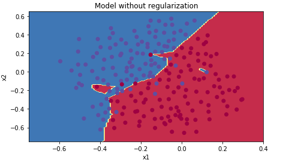
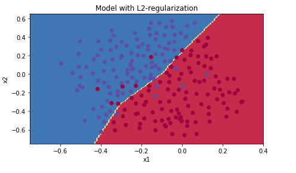
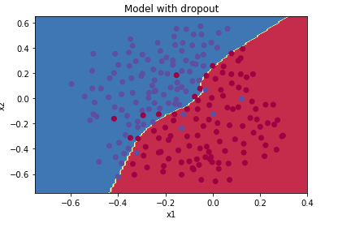

# Regularization-NeuralNetwork
Implementation of L2-Regularization and Dropout Regularization for a neural network.

## Overview:

This repository contains implementation of two regularization techniques for reducing overfitting for a neural network. It includes following steps:

- Loading necessary packages.
- Implementing the model without regualization and analyzing the results.
- Implementing two regularization techniques.
  1. L-2 Regularization
  2. Dropout Regularization
- Modifying the forward and backward propagation of previous model to include regularization.
- Analyzing the results again with regularization.
- Training the model with training dataset.
- Testing the accuracy of model with test dataset.

Without implementing regularization, the decision boundary for the trained neural network looks as shown in the figure:

L2-regularization relies on the assumption that a model with small weights is simpler than a model with large weights. Thus, by penalizing the square values of the weights in the cost function you drive all the weights to smaller values. It becomes too costly for the cost to have large weights! This leads to a smoother model in which the output changes more slowly as the input changes. The decision boundary with L2-regularization is shown here:

Dropout is a widely used regularization technique that is specific to deep learning.It randomly shuts down some neurons in each iteration. Dropout should be used only while training the model. We apply dropout both during forward and backward propagation.
And, during training time, divide each dropout layer by keep_prob(variable to store the percentage of neurons to dropout) to keep the same expected value for the activations.  The decision boundary with Dropout-regularization is shown here:

## Dependencies:

To run this project, you need to have deep learning setup in your local machine.

## Windows:

Follow the instruction [here](http://inmachineswetrust.com/posts/deep-learning-setup/) to install conda on windows.

After following the above instructions, you need to install pillow and pytables into the conda deeplearning environment:
 - Make sure deeplearning environment is active:
   `activate deeplearning`
 - Then, run following commands: 
   
   `conda install pillow`
   
   `conda install pytables`

   `conda install h5py`

## Ubuntu

Follow the steps in this link [here](https://medium.com/@iamHarin17/how-to-setup-a-python-environment-for-deep-learning-with-anaconda-f65ab78a362) to setup a deep learing environment in Ubuntu .

## Instructions to run the project:

After setting up deep learning environment, follow these steps to run the .ipynb file that contains code for logistic regression.

-  `git clone https://github.com/nakul3112/Regularization-NeuralNetwork.git`
-  Ubuntu: `conda activate <environment-name>`

     Windows: `activate <environment-name>`

     Replace the environment name above with the name of your deep learning environment.
-  Run jupyter notebook after opeinmg the terminal in the cloned repository.

     `jupyter notebook`
-  Navigate to the .ipynb file and run the kernel.

